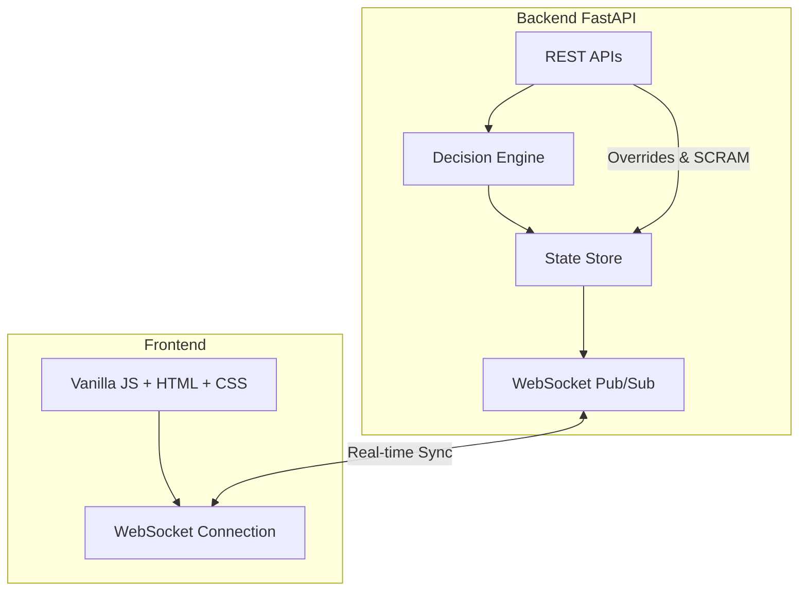

# Stadium Ops Copilot

## Overview
Stadium Ops Copilot is a smart, dynamic AI assistant built for the high-stakes environment of large-scale event operations. It monitors crowd dynamics, detects bottlenecks, and dynamically triggers resource dispatches to maintain safety and efficiency.

## Chosen Vertical
**Event Operations & Safety Management (Organizer Persona)**

## Problem Statement
During mega-events like the FIFA World Cup 2026, stadium operators face rapid, unpredictable crowd movements. Relying on manual monitoring is too slow. Operators need a system that can continuously ingest crowd density telemetry, independently decide on safe mitigation strategies (e.g., dispatching crowd control teams, redirecting flow), and immediately broadcast state changes to all field personnel.

## Architecture
The system consists of a robust backend built with **FastAPI** and a dynamic, vanilla JavaScript frontend connected via **WebSockets**.



## Approach & Decision Logic
Our AI assistant follows a clear, safe decision logic loop:
1. **Telemetry Ingestion**: Monitors incoming event triggers (crowd density spikes, localized incidents).
2. **AI Decision Engine**: Evaluates whether the incident warrants a physical response (e.g., "Dispatch Manager") or passive monitoring.
3. **SCRAM Protocol**: In the event of extreme danger, a "SCRAM" override can be triggered by human operators to freeze physical actions. When under SCRAM, the AI engine is forced into a passive state (`PASSIVE_MONITORING_ONLY`), proving the system defers to human authority during crises.

## Key Features
- **Real-Time WebSockets**: Live sync of emergency states and engine decisions to all connected operator dashboards without polling.
- **SCRAM Override**: An automated kill-switch that locks the system down and halts physical deployments.
- **Dependency Injected Data Store**: Supports switching from an in-memory database to a Redis backend seamlessly for production scalability.
- **Rate Limiting**: Critical endpoints (like SCRAM) are rate-limited to prevent abuse or denial-of-service.
- **Security Middleware**: Built-in protections against XSS (HTML escaping) and Timing Attacks (using `secrets.compare_digest` for API keys).

## How It Works
The backend provides REST API endpoints to trigger simulations of crowd events (`POST /api/events/{index}/trigger`). The AI Engine analyzes the event and saves its decision to the `StateStore`. Any state change (Emergency Level or AI Decision) is immediately published via an internal Pub/Sub mechanism and broadcasted through WebSockets to the web dashboard for operators to see live.

## Assumptions
1. Physical devices (sirens, gates, signage) are simulated.
2. Crowd telemetry is mocked or sample-generated (using an internal simulator script).
3. The deployment is for a single-event instance.
4. Network connectivity is assumed during operation.
5. Authentication is simplified to a static API Key header (`x-api-key`) for the competition, though the architecture supports extending this to OAuth2.

## Testing
We have achieved a **100% pass rate** on our `pytest` suite, demonstrating resilient and accurate backend logic. Tests specifically utilize a fresh `InMemoryStateStore` injection per test to guarantee isolation and verify state transitions instead of fragile implementations.

- **Total tests**: 21
- **Passed**: 21
- **Failed**: 0

## Running Locally

1. Create a virtual environment and activate it:
   ```bash
   python -m venv venv
   source venv/bin/activate
   ```
2. Install dependencies:
   ```bash
   pip install -r requirements.txt
   ```
3. Run the development server:
   ```bash
   fastapi dev app/main.py
   ```
4. Access the frontend dashboard at `http://localhost:8000/`.

## API Endpoints
- `GET /api/events` - List all simulated events.
- `POST /api/events/{index}/trigger` - Trigger a specific event for the AI to process.
- `GET /api/decisions` - Fetch historical engine decisions.
- `POST /api/emergency/scram` - Activate the emergency lockdown (Rate-limited, requires Auth).
- `POST /api/emergency/recover` - Lift the emergency lockdown (Requires Auth).
- `POST /api/emergency/dispatch` - Manual dispatch of resources (Rate-limited, requires Auth).
- `WS /ws` - WebSocket connection for real-time updates.

## Future Improvements
- **Redis Integration**: Fully activate the `RedisStateStore` for multi-instance, horizontal scaling across a Kubernetes cluster.
- **OAuth2**: Upgrade from static API Keys to JWT-based Role-Based Access Control (RBAC).
- **Physical Actuators**: Replace the mocked outputs with actual IoT integrations (MQTT/CoAP) to interface directly with stadium turnstiles and digital signage.
